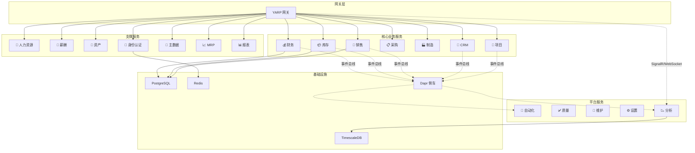
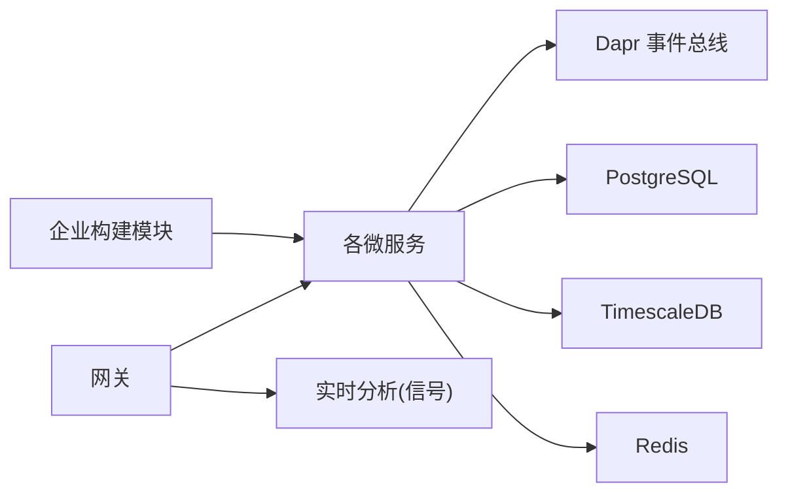

# 开发路线图

<cite>
**本文引用的文件**
- [README.md](file://README.md)
- [DEVELOPMENT_PLAN.md](file://DEVELOPMENT_PLAN.md)
- [ITERATION-02-COMPLETED.md](file://docs/ITERATION-02-COMPLETED.md)
- [ITERATION-03-COMPLETED.md](file://docs/ITERATION-03-COMPLETED.md)
- [PRD-01-MasterData-Service.md](file://docs/PRD-01-MasterData-Service.md)
- [PRD-05-Inventory-Service.md](file://docs/PRD-05-Inventory-Service.md)
- [PRD-09-Next-Iteration-Intelligence.md](file://docs/PRD-09-Next-Iteration-Intelligence.md)
- [DependencyInjection.cs](file://src/BuildingBlocks/ErpSystem.BuildingBlocks/DependencyInjection.cs)
- [values.yaml](file://deploy/helm/erp-system/values.yaml)
- [docker-compose.yml](file://docker-compose.yml)
</cite>

## 目录
1. [简介](#简介)
2. [项目结构](#项目结构)
3. [核心组件](#核心组件)
4. [架构总览](#架构总览)
5. [详细组件分析](#详细组件分析)
6. [依赖分析](#依赖分析)
7. [性能考虑](#性能考虑)
8. [故障排除指南](#故障排除指南)
9. [结论](#结论)
10. [附录](#附录)

## 简介
本开发路线图系统性梳理 ERP 微服务项目的演进历程与未来规划，覆盖已完成的功能阶段、当前开发状态、各迭代周期目标与完成情况、关键里程碑，以及未来版本的功能规划与优先级排序。同时，给出技术债务处理与架构演进的长期规划、社区贡献与开源协作参与方式，帮助潜在贡献者明确参与路径与期望。

## 项目结构
项目采用微服务架构，围绕领域驱动设计（DDD）与企业级模式（CQRS、事件溯源、Outbox、Resilience、MultiTenancy 等）构建，包含网关层、核心业务服务、支撑服务与平台服务，以及基础设施层（PostgreSQL/TimescaleDB、Redis、Dapr）。前端为 React SPA，提供可视化分析与实时看板。

图表来源
- [README.md](file://README.md#L130-L183)

章节来源
- [README.md](file://README.md#L289-L322)

## 核心组件
- 企业级构建模块（BuildingBlocks）
  - 提供跨服务的共享能力：CQRS 抽象、行为管道（验证、日志、幂等、审计、性能）、领域事件、Outbox、多租户、可观测性、缓存、鉴权中间件等。
  - 通过依赖注入集中注册验证器与管道行为，统一横切关注点。
- 网关（Gateway）
  - 基于 YARP 的反向代理，统一入口与服务发现，承载前端实时连接（SignalR/WebSocket）。
- 服务边界与职责
  - 核心业务：Finance、Inventory、Sales、Procurement、Production、CRM、Projects
  - 支撑服务：HR、Payroll、Assets、Identity、MasterData、MRP、Reporting
  - 平台服务：Automation、Quality、Maintenance、Settings、Analytics

章节来源
- [DependencyInjection.cs](file://src/BuildingBlocks/ErpSystem.BuildingBlocks/DependencyInjection.cs#L10-L30)
- [README.md](file://README.md#L185-L213)

## 架构总览
- 设计模式
  - DDD：聚合、值对象、领域事件、规格模式
  - CQRS：命令/查询分离，MediatR 管道
  - 事件溯源：完整审计轨迹与时间旅行查询
  - Saga：分布式事务通过 Dapr 协调
  - Outbox：EF Core 事务内可靠事件发布
  - Specification：可复用查询逻辑
  - Result 模式：面向对象的错误处理
- 企业构建模块
  - 统一的共享内核，降低重复、提升一致性与可测试性
- 部署与运维
  - Docker Compose 与 Helm Chart，支持 Kubernetes 编排与弹性扩缩容
  - Dapr 作为服务间通信与状态/发布订阅抽象

章节来源
- [README.md](file://README.md#L185-L213)
- [README.md](file://README.md#L255-L283)

## 详细组件分析

### 已完成阶段与当前状态
- 阶段回顾（全部完成）
  - 基础设施与事件溯源
  - 财务模块（总账）
  - 库存与采购
  - MRP（物料需求计划）
  - 企业构建模块
  - 报表与 BI 仪表盘
  - Kubernetes 与 Helm
  - CRM 与客户门户
  - 项目管理与工时
  - 薪酬与薪酬
  - 资产全生命周期
  - 实时通知（SignalR）
  - AI 驱动的需求预测（ML.NET）

章节来源
- [README.md](file://README.md#L343-L360)

### 迭代 02：智能与自动化（已完成）
- 目标：从“数字化核心”迈向“智能自动化”
- 核心成果
  - 财务智能化：实时移动加权平均成本、跨服务成本同步、成本历史追溯
  - 智能 MRP：自动补货规则引擎、采购建议生成与审批、多维度库存预测
  - 流程自动化：事件驱动规则引擎、多种动作类型（邮件、Webhook、通知）、灵活条件配置
  - 基础设施：TimescaleDB 时序数据库、超表与连续聚合、高性能时序查询
- 技术栈：.NET 10、TimescaleDB、Dapr、事件溯源+CQRS、DDD

章节来源
- [ITERATION-02-COMPLETED.md](file://docs/ITERATION-02-COMPLETED.md#L1-L41)

### 迭代 03：高级智能、质量与分析（已完成）
- 目标：从“自动化”迈向“预测与治理”
- 核心成果
  - AI 预测分析：ML.NET 销售需求预测引擎、TimescaleDB 时序特征提取
  - 质量管理：动态质检点配置、自动化质检任务触发、质量预警与闭环
  - 设备治理：设备台账、预防性维护计划、与 OEE 监控集成
  - 视觉化分析：实时库存周转率监控、综合设备效率看板 API
- 交付物：完整实施报告、产品需求文档（PRD）、实现计划

章节来源
- [ITERATION-03-COMPLETED.md](file://docs/ITERATION-03-COMPLETED.md#L1-L35)

### 下一迭代（迭代 04）：预测与治理深化
- 目标：延续迭代 03 的“预测与治理”，进一步完善 AI 预测体系、质量与维护治理能力
- 关键主题
  - AI 预测模型优化：引入更丰富的时序特征、多变量回归、置信区间与异常检测
  - 质量闭环：质检预警到整改的自动化工作流、质量 KPI 指标看板
  - 设备治理：OEE 指标细化、维护计划与生产效率联动、预测性维护
  - 预测驱动的运营：基于预测的自动补货、安全库存动态调整
- 技术演进
  - 读模型增强：TimescaleDB 连续聚合与物化视图
  - 跨服务 Saga：借助 Dapr Workflow 或 MassTransit State Machine 管理长事务
  - 实时分析：SignalR 实时看板与告警推送

章节来源
- [PRD-09-Next-Iteration-Intelligence.md](file://docs/PRD-09-Next-Iteration-Intelligence.md#L1-L99)

### 产品需求文档（PRD）要点（节选）
- 主数据服务（MasterData）
  - 物料主数据：基础信息、标准成本、启用/停用、扩展属性、分类、多单位、替代关系、BOM 关联
  - 供应商主数据：基础信息、分类分级、绩效管理、黑名单
  - 客户主数据：基础信息、信用管理、分组与生命周期
  - 仓库与库位：仓库档案、库位结构与分配策略
  - 实现优先级：P0-P3 分层，确保核心功能优先落地
- 库存服务（Inventory）
  - 核心概念：InventoryItem、StockTransaction、StockReservation、StockAdjustment
  - 功能：入库/出库、预留/释放、盘点/调整、基础报表
  - 集成：与 MasterData、Procurement、Sales、Production、Finance 的事件/接口集成
  - 非功能性：性能、安全、审计

章节来源
- [PRD-01-MasterData-Service.md](file://docs/PRD-01-MasterData-Service.md#L743-L775)
- [PRD-05-Inventory-Service.md](file://docs/PRD-05-Inventory-Service.md#L500-L521)

### 企业构建模块（BuildingBlocks）演进
- 当前能力
  - 行为管道：验证、日志、幂等、审计、性能
  - CQRS 抽象、领域事件、Outbox、多租户、缓存、可观测性、鉴权中间件
- 未来方向
  - 统一错误码与响应格式
  - 增强可观测性（指标、日志、追踪）与告警
  - 服务网格与 API 网关能力下沉
  - 跨语言 SDK 与协议兼容

章节来源
- [DependencyInjection.cs](file://src/BuildingBlocks/ErpSystem.BuildingBlocks/DependencyInjection.cs#L10-L30)

### 部署与运行时配置
- Docker Compose
  - 本地开发：Identity、Gateway、Dapr Placement、Redis、PostgreSQL（TimescaleDB 扩展）、Zipkin
  - 环境变量与依赖顺序，便于快速启动与联调
- Helm Chart
  - 服务启停、副本数、镜像仓库与标签、Ingress、PostgreSQL/Redis 配置、Dapr 组件
  - 支持按环境覆盖 values.yaml

章节来源
- [docker-compose.yml](file://docker-compose.yml#L1-L99)
- [values.yaml](file://deploy/helm/erp-system/values.yaml#L1-L127)

## 依赖分析
- 组件耦合与内聚
  - 核心服务之间通过 Dapr 事件总线解耦，读模型通过事件投影独立演化
  - BuildingBlocks 提供高内聚的横切能力，降低服务重复实现
- 外部依赖
  - PostgreSQL/TimescaleDB：事件存储与时序数据
  - Redis：Dapr 状态/发布订阅、身份认证缓存
  - Dapr：服务发现、事件总线、状态管理
- 潜在循环依赖
  - 通过事件与读模型避免直接循环调用，遵循 CQRS 与事件驱动

图表来源
- [README.md](file://README.md#L130-L183)
- [values.yaml](file://deploy/helm/erp-system/values.yaml#L117-L123)

章节来源
- [README.md](file://README.md#L130-L183)
- [values.yaml](file://deploy/helm/erp-system/values.yaml#L1-L127)

## 性能考虑
- 事件溯源与 CQRS
  - 写模型与读模型分离，读模型针对查询进行优化（索引、物化视图、连续聚合）
- TimescaleDB
  - 时序数据高效聚合与查询，支持连续聚合与物化视图
- 缓存与多租户
  - 分布式缓存与查询过滤，降低数据库压力
- 弹性与可观测性
  - Polly 策略、熔断与超时，结合 Zipkin/OTel 追踪
- 部署弹性
  - Helm 副本数与资源限制，满足并发与 SLA

## 故障排除指南
- 常见问题
  - 事件未消费或重复消费：检查 Outbox/Inbox 表状态与消费者幂等逻辑
  - 读模型不同步：确认事件订阅与投影进程运行状态
  - 数据库连接失败：核对连接字符串与容器网络
  - Dapr 组件未就绪：检查 placement 与 daprd 日志
- 排查步骤
  - 查看服务日志与 Dapr sidecar 日志
  - 使用 Zipkin 追踪请求链路
  - 核对 Helm values 与环境变量
- 参考
  - Docker Compose 与 Helm 配置文件，确认服务依赖与端口映射

章节来源
- [docker-compose.yml](file://docker-compose.yml#L1-L99)
- [values.yaml](file://deploy/helm/erp-system/values.yaml#L1-L127)

## 结论
本路线图展示了 ERP 系统从基础设施到智能自动化与预测治理的完整演进路径。已完成的阶段奠定了坚实的技术底座，当前已进入“预测与治理”深化阶段。未来将持续完善 AI 预测、质量与维护治理、实时分析与告警，同时加强企业构建模块与可观测性，推动系统向更高水平的智能化与工程化迈进。

## 附录

### 未来版本功能规划与优先级
- 近期（迭代 04）
  - AI 预测模型优化与异常检测
  - 质量预警到整改的自动化闭环
  - 设备 OEE 与预测性维护
  - 基于预测的安全库存动态调整
- 中期（迭代 05）
  - 供应链协同与供应商智能评级
  - 生产执行与质量联动
  - 薪酬与绩效分析看板
- 远期（迭代 06+）
  - 低代码自动化规则平台
  - 多工厂/多组织的 SaaS 化能力
  - 与第三方系统（WMS、TMS、OA）深度集成

### 技术债务与架构演进
- 技术债务
  - 部分服务仍处于事件驱动早期，Saga 与补偿事务需进一步完善
  - 部分读模型未充分物化，查询性能有待优化
  - 部分服务缺少统一的错误码与响应格式
- 架构演进
  - 引入 Dapr Workflow 或 MassTransit State Machine 管理长事务
  - 加强可观测性与告警体系
  - 企业构建模块持续沉淀与标准化

### 社区贡献与开源协作
- 参与方式
  - Fork 仓库 → 分支开发 → 编写测试 → 提交 PR
  - 遵循现有代码风格与 PRD/设计文档
  - 使用 GitHub Issues 提交缺陷与功能请求
- 贡献路径
  - 从 P0/P1 功能入手，优先修复阻塞性问题
  - 参与 PRD 讨论与评审，提出改进建议
  - 协助完善文档与测试覆盖率

章节来源
- [README.md](file://README.md#L363-L372)