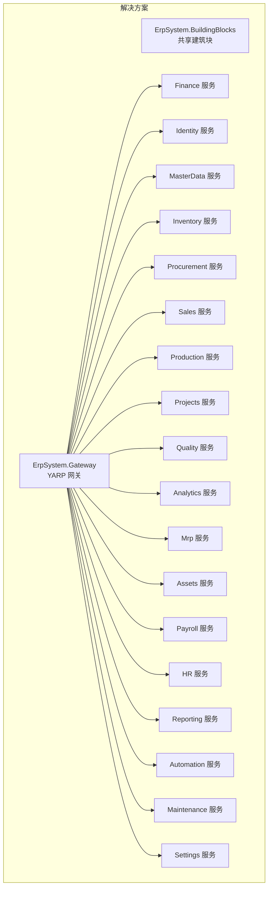
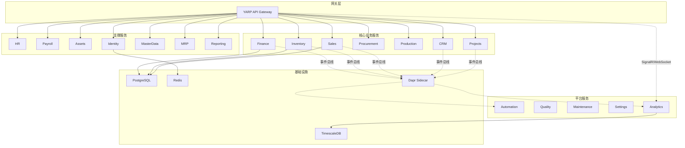
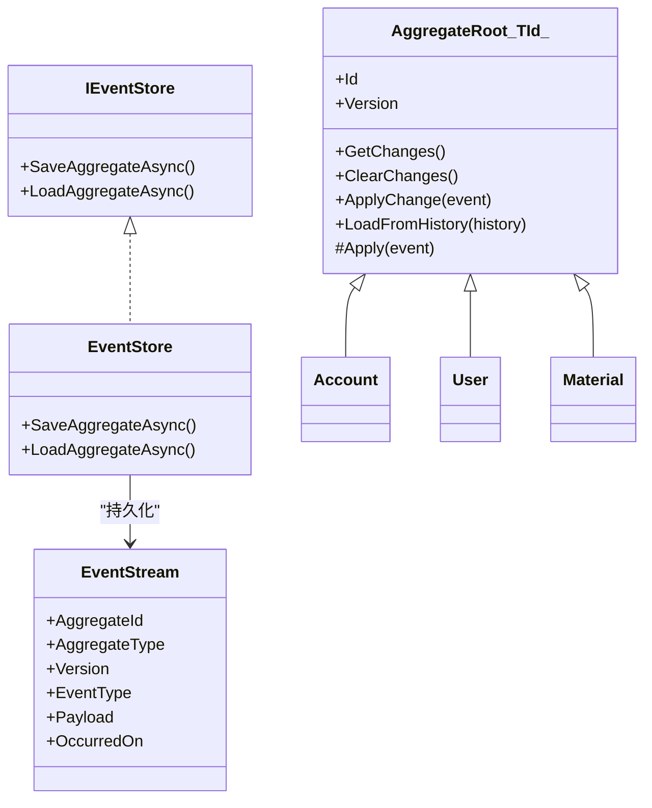
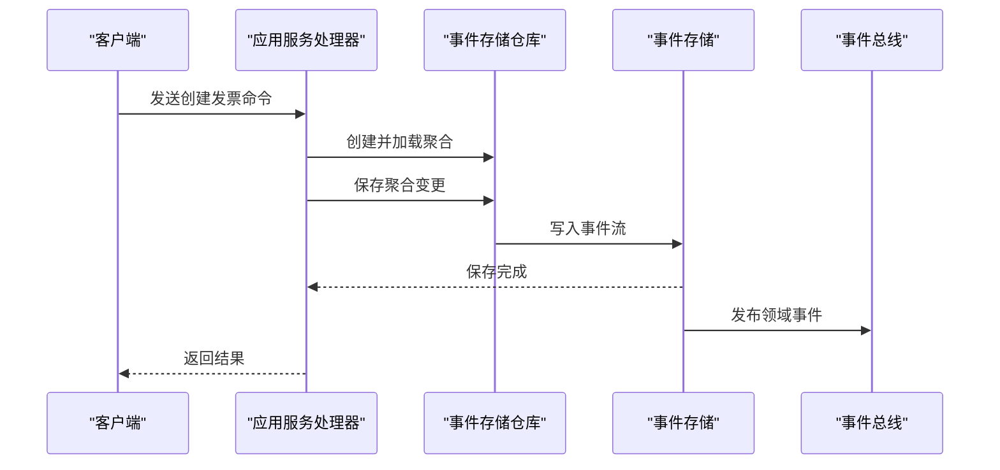
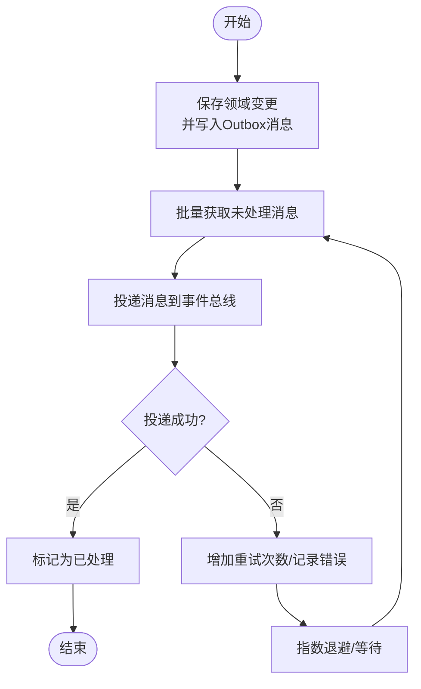
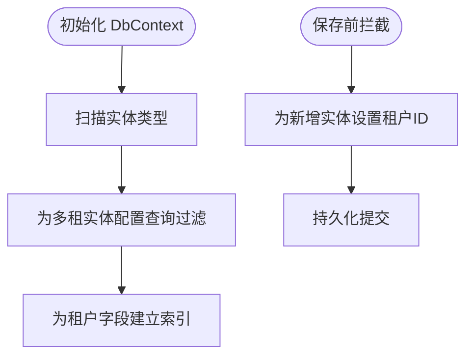
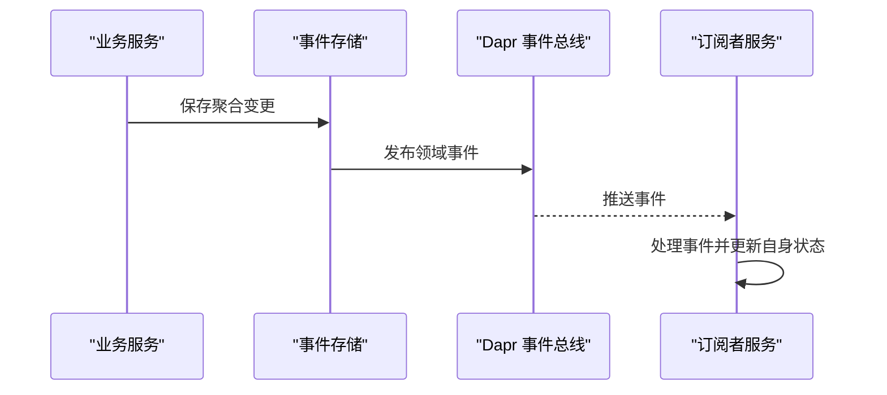
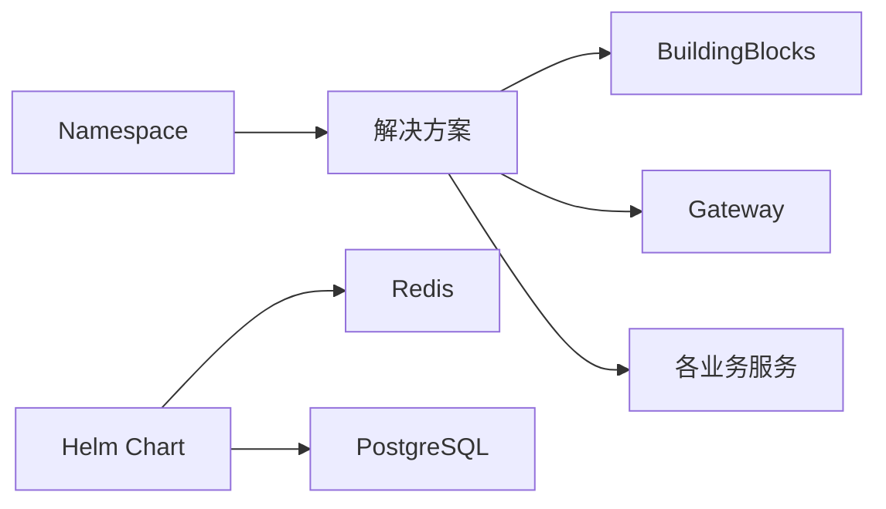

# 架构设计理念

<cite>
**本文引用的文件**
- [README.md](file://README.md)
- [src/ErpSystem.sln](file://src/ErpSystem.sln)
- [src/BuildingBlocks/ErpSystem.BuildingBlocks/DependencyInjection.cs](file://src/BuildingBlocks/ErpSystem.BuildingBlocks/DependencyInjection.cs)
- [src/BuildingBlocks/ErpSystem.BuildingBlocks/CQRS/Abstractions.cs](file://src/BuildingBlocks/ErpSystem.BuildingBlocks/CQRS/Abstractions.cs)
- [src/BuildingBlocks/ErpSystem.BuildingBlocks/Domain/DDDBase.cs](file://src/BuildingBlocks/ErpSystem.BuildingBlocks/Domain/DDDBase.cs)
- [src/BuildingBlocks/ErpSystem.BuildingBlocks/Outbox/OutboxMessage.cs](file://src/BuildingBlocks/ErpSystem.BuildingBlocks/Outbox/OutboxMessage.cs)
- [src/BuildingBlocks/ErpSystem.BuildingBlocks/MultiTenancy/MultiTenancy.cs](file://src/BuildingBlocks/ErpSystem.BuildingBlocks/MultiTenancy/MultiTenancy.cs)
- [src/BuildingBlocks/ErpSystem.BuildingBlocks/EventBus/DaprEventBus.cs](file://src/BuildingBlocks/ErpSystem.BuildingBlocks/EventBus/DaprEventBus.cs)
- [src/Gateways/ErpSystem.Gateway/Program.cs](file://src/Gateways/ErpSystem.Gateway/Program.cs)
- [src/Services/Finance/ErpSystem.Finance/Application/FinanceCommands.cs](file://src/Services/Finance/ErpSystem.Finance/Application/FinanceCommands.cs)
- [src/Services/Finance/ErpSystem.Finance/Domain/AccountAggregate.cs](file://src/Services/Finance/ErpSystem.Finance/Domain/AccountAggregate.cs)
- [src/Services/Identity/ErpSystem.Identity/Domain/UserAggregate.cs](file://src/Services/Identity/ErpSystem.Identity/Domain/UserAggregate.cs)
- [src/Services/MasterData/ErpSystem.MasterData/Domain/MaterialAggregate.cs](file://src/Services/MasterData/ErpSystem.MasterData/Domain/MaterialAggregate.cs)
- [deploy/k8s/namespace.yaml](file://deploy/k8s/namespace.yaml)
- [deploy/helm/erp-system/Chart.yaml](file://deploy/helm/erp-system/Chart.yaml)
</cite>

## 目录
1. [引言](#引言)
2. [项目结构](#项目结构)
3. [核心组件](#核心组件)
4. [架构总览](#架构总览)
5. [详细组件分析](#详细组件分析)
6. [依赖分析](#依赖分析)
7. [性能考虑](#性能考虑)
8. [故障排查指南](#故障排查指南)
9. [结论](#结论)
10. [附录](#附录)

## 引言
本项目是一个基于 .NET 10 的云原生企业 ERP 微服务系统，采用微服务架构与企业级设计模式（事件溯源、领域驱动设计、CQRS 等），结合 Dapr 边车、Kubernetes/Helm 部署，以及 TimescaleDB 时序数据库与 Redis 缓存，构建高可用、可观测、可扩展的企业级平台。本文档从架构设计理念出发，系统阐述微服务设计原则、实施策略与关键模式组合，并对多租户、分布式事务、服务间通信等高级特性进行深入解析。

## 项目结构
项目采用“解决方案分层 + 多服务模块”的组织方式：顶层解决方案包含共享“建筑块”（BuildingBlocks）与多个业务服务；网关层统一入口；部署层提供 Kubernetes 与 Helm 支持。

图表来源
- [src/ErpSystem.sln](file://src/ErpSystem.sln#L1-L400)

章节来源
- [README.md](file://README.md#L289-L322)
- [src/ErpSystem.sln](file://src/ErpSystem.sln#L1-L400)

## 核心组件
围绕企业级能力，系统在共享建筑块中提供了横切关注点与通用基础设施，支撑各业务服务的快速演进与一致性交付。

- 共享建筑块（BuildingBlocks）
  - CQRS 抽象：命令/查询接口与处理器抽象，统一写读分离入口。
  - 领域建模：聚合根基类、事件流存储、事件发布机制。
  - 事务外盒：Outbox 模式保障跨服务可靠消息投递。
  - 多租户：全局查询过滤与保存拦截器，实现 SaaS 租户隔离。
  - 中间件与行为：日志、验证、幂等、性能监控等管道行为。
  - 事件总线：Dapr 事件总线封装，支持发布订阅。
  - 可观测性与弹性：健康检查、重试、熔断、超时、限流等。

章节来源
- [src/BuildingBlocks/ErpSystem.BuildingBlocks/CQRS/Abstractions.cs](file://src/BuildingBlocks/ErpSystem.BuildingBlocks/CQRS/Abstractions.cs#L1-L39)
- [src/BuildingBlocks/ErpSystem.BuildingBlocks/Domain/DDDBase.cs](file://src/BuildingBlocks/ErpSystem.BuildingBlocks/Domain/DDDBase.cs#L1-L137)
- [src/BuildingBlocks/ErpSystem.BuildingBlocks/Outbox/OutboxMessage.cs](file://src/BuildingBlocks/ErpSystem.BuildingBlocks/Outbox/OutboxMessage.cs#L1-L82)
- [src/BuildingBlocks/ErpSystem.BuildingBlocks/MultiTenancy/MultiTenancy.cs](file://src/BuildingBlocks/ErpSystem.BuildingBlocks/MultiTenancy/MultiTenancy.cs#L1-L100)
- [src/BuildingBlocks/ErpSystem.BuildingBlocks/EventBus/DaprEventBus.cs](file://src/BuildingBlocks/ErpSystem.BuildingBlocks/EventBus/DaprEventBus.cs#L1-L31)
- [src/BuildingBlocks/ErpSystem.BuildingBlocks/DependencyInjection.cs](file://src/BuildingBlocks/ErpSystem.BuildingBlocks/DependencyInjection.cs#L1-L31)

## 架构总览
系统采用“网关 + 微服务 + 事件驱动 + 平台服务”的分层架构。网关负责路由与弹性策略；核心业务服务围绕领域模型与事件流协作；平台服务提供自动化、质量、维护、设置等通用能力；基础设施层包含 PostgreSQL、TimescaleDB、Redis 与 Dapr。

图表来源
- [README.md](file://README.md#L130-L183)

章节来源
- [README.md](file://README.md#L130-L196)

## 详细组件分析

### 事件溯源与领域驱动设计（DDD）
- 聚合根与事件流
  - 聚合根基类记录变更历史，通过 ApplyChange 与 Apply 统一状态迁移，支持从历史重建状态。
  - 事件流持久化为 EventStream，包含聚合类型、版本、事件类型与序列化载荷，支持时间旅行与审计。
- 事件发布
  - 保存聚合变更后，同时通过 MediatR 与 Dapr 事件总线发布领域事件，确保跨服务一致性。
- 实践示例
  - 财务账户聚合：通过 AccountCreatedEvent、AccountDetailsUpdatedEvent 等事件驱动状态变化。
  - 用户聚合：登录成功、失败、锁定、解锁、角色分配、密码变更等事件完整刻画用户生命周期。
  - 物料主数据聚合：物料创建、信息更新、成本变更、属性更新、状态切换等事件驱动主数据演进。

图表来源
- [src/BuildingBlocks/ErpSystem.BuildingBlocks/Domain/DDDBase.cs](file://src/BuildingBlocks/ErpSystem.BuildingBlocks/Domain/DDDBase.cs#L14-L120)
- [src/Services/Finance/ErpSystem.Finance/Domain/AccountAggregate.cs](file://src/Services/Finance/ErpSystem.Finance/Domain/AccountAggregate.cs#L41-L86)
- [src/Services/Identity/ErpSystem.Identity/Domain/UserAggregate.cs](file://src/Services/Identity/ErpSystem.Identity/Domain/UserAggregate.cs#L55-L163)
- [src/Services/MasterData/ErpSystem.MasterData/Domain/MaterialAggregate.cs](file://src/Services/MasterData/ErpSystem.MasterData/Domain/MaterialAggregate.cs#L84-L177)

章节来源
- [src/BuildingBlocks/ErpSystem.BuildingBlocks/Domain/DDDBase.cs](file://src/BuildingBlocks/ErpSystem.BuildingBlocks/Domain/DDDBase.cs#L1-L137)
- [src/Services/Finance/ErpSystem.Finance/Domain/AccountAggregate.cs](file://src/Services/Finance/ErpSystem.Finance/Domain/AccountAggregate.cs#L1-L87)
- [src/Services/Identity/ErpSystem.Identity/Domain/UserAggregate.cs](file://src/Services/Identity/ErpSystem.Identity/Domain/UserAggregate.cs#L1-L164)
- [src/Services/MasterData/ErpSystem.MasterData/Domain/MaterialAggregate.cs](file://src/Services/MasterData/ErpSystem.MasterData/Domain/MaterialAggregate.cs#L1-L178)

### CQRS 模式与 MediatR 管道
- 命令/查询职责分离：通过 ICommand/IQuery 抽象与处理器接口，明确读写边界。
- 应用服务编排：Finance 命令处理器根据业务规则协调聚合操作，保存事件并触发后续流程。
- 管道行为：日志、验证、幂等、性能监控等横切逻辑通过 MediatR 管道注入，保证一致性与可观测性。

图表来源
- [src/BuildingBlocks/ErpSystem.BuildingBlocks/CQRS/Abstractions.cs](file://src/BuildingBlocks/ErpSystem.BuildingBlocks/CQRS/Abstractions.cs#L1-L39)
- [src/Services/Finance/ErpSystem.Finance/Application/FinanceCommands.cs](file://src/Services/Finance/ErpSystem.Finance/Application/FinanceCommands.cs#L45-L141)
- [src/BuildingBlocks/ErpSystem.BuildingBlocks/Domain/DDDBase.cs](file://src/BuildingBlocks/ErpSystem.BuildingBlocks/Domain/DDDBase.cs#L122-L136)
- [src/BuildingBlocks/ErpSystem.BuildingBlocks/EventBus/DaprEventBus.cs](file://src/BuildingBlocks/ErpSystem.BuildingBlocks/EventBus/DaprEventBus.cs#L11-L21)

章节来源
- [src/BuildingBlocks/ErpSystem.BuildingBlocks/CQRS/Abstractions.cs](file://src/BuildingBlocks/ErpSystem.BuildingBlocks/CQRS/Abstractions.cs#L1-L39)
- [src/Services/Finance/ErpSystem.Finance/Application/FinanceCommands.cs](file://src/Services/Finance/ErpSystem.Finance/Application/FinanceCommands.cs#L1-L142)

### 事务外盒（Outbox）与可靠事件发布
- 设计目标：在本地事务内持久化待发送消息，随后异步投递，避免跨服务一致性问题。
- 关键点：消息实体包含类型、载荷、重试次数与错误信息；EF Core 配置索引以高效筛选未处理消息；处理器按批次拉取并更新处理状态。
- 适用场景：跨服务集成事件、下游通知、审计日志等。

图表来源
- [src/BuildingBlocks/ErpSystem.BuildingBlocks/Outbox/OutboxMessage.cs](file://src/BuildingBlocks/ErpSystem.BuildingBlocks/Outbox/OutboxMessage.cs#L1-L82)

章节来源
- [src/BuildingBlocks/ErpSystem.BuildingBlocks/Outbox/OutboxMessage.cs](file://src/BuildingBlocks/ErpSystem.BuildingBlocks/Outbox/OutboxMessage.cs#L1-L82)

### 多租户架构与查询过滤
- 全局查询过滤：为所有实现 IMultiTenantEntity 的实体配置租户过滤条件，确保读取隔离。
- 保存拦截器：自动为新增实体填充租户标识，避免遗漏。
- 配置扩展：通过反射扫描实体类型，动态应用过滤与索引，降低样板代码。

图表来源
- [src/BuildingBlocks/ErpSystem.BuildingBlocks/MultiTenancy/MultiTenancy.cs](file://src/BuildingBlocks/ErpSystem.BuildingBlocks/MultiTenancy/MultiTenancy.cs#L29-L63)
- [src/BuildingBlocks/ErpSystem.BuildingBlocks/MultiTenancy/MultiTenancy.cs](file://src/BuildingBlocks/ErpSystem.BuildingBlocks/MultiTenancy/MultiTenancy.cs#L68-L99)

章节来源
- [src/BuildingBlocks/ErpSystem.BuildingBlocks/MultiTenancy/MultiTenancy.cs](file://src/BuildingBlocks/ErpSystem.BuildingBlocks/MultiTenancy/MultiTenancy.cs#L1-L100)

### 服务间通信与事件总线
- Dapr 事件总线：统一发布订阅模型，Topic 名称约定为事件类型名，便于解耦与扩展。
- 网关弹性：在网关侧配置标准化弹性管道（重试、熔断、超时、限流），保护后端服务免受瞬时故障影响。
- 本地开发与测试：提供 Dummy 事件总线用于离线或测试环境，降低依赖复杂度。

图表来源
- [src/BuildingBlocks/ErpSystem.BuildingBlocks/EventBus/DaprEventBus.cs](file://src/BuildingBlocks/ErpSystem.BuildingBlocks/EventBus/DaprEventBus.cs#L11-L21)
- [src/Gateways/ErpSystem.Gateway/Program.cs](file://src/Gateways/ErpSystem.Gateway/Program.cs#L30-L58)

章节来源
- [src/BuildingBlocks/ErpSystem.BuildingBlocks/EventBus/DaprEventBus.cs](file://src/BuildingBlocks/ErpSystem.BuildingBlocks/EventBus/DaprEventBus.cs#L1-L31)
- [src/Gateways/ErpSystem.Gateway/Program.cs](file://src/Gateways/ErpSystem.Gateway/Program.cs#L1-L107)

### 分布式事务与 Saga 协议
- 事务外盒：通过 Outbox 模式在本地事务内落盘消息，再由后台进程异步投递，避免跨服务强一致带来的复杂性。
- 事件驱动编排：利用领域事件与事件总线，配合应用服务编排，实现跨聚合、跨服务的最终一致性。
- Dapr 协议：结合 Dapr Sidecar 的发布订阅与可靠消息，形成轻量级 Saga/Saga-like 协议，满足大多数业务场景。

章节来源
- [src/BuildingBlocks/ErpSystem.BuildingBlocks/Outbox/OutboxMessage.cs](file://src/BuildingBlocks/ErpSystem.BuildingBlocks/Outbox/OutboxMessage.cs#L1-L82)
- [README.md](file://README.md#L185-L196)

## 依赖分析
- 解决方案与项目映射：通过 .sln 文件可见各服务与共享模块的归属关系，便于构建与测试管理。
- 部署依赖：Helm Chart 声明 Redis 与 PostgreSQL 依赖，命名空间定义了资源隔离边界。
- 运行时依赖：网关侧引入弹性策略与健康检查，服务侧依赖 Dapr 事件总线与 EF Core 仓储。

图表来源
- [src/ErpSystem.sln](file://src/ErpSystem.sln#L1-L400)
- [deploy/helm/erp-system/Chart.yaml](file://deploy/helm/erp-system/Chart.yaml#L18-L27)
- [deploy/k8s/namespace.yaml](file://deploy/k8s/namespace.yaml#L1-L8)

章节来源
- [src/ErpSystem.sln](file://src/ErpSystem.sln#L1-L400)
- [deploy/helm/erp-system/Chart.yaml](file://deploy/helm/erp-system/Chart.yaml#L1-L27)
- [deploy/k8s/namespace.yaml](file://deploy/k8s/namespace.yaml#L1-L8)

## 性能考虑
- 事件溯源与读写分离：通过事件存储与投影分离读模型，减少写路径锁竞争，提升吞吐。
- Outbox 批处理：按批获取与投递消息，降低数据库压力与网络开销。
- 缓存与索引：多租户实体对租户字段建立索引，加速查询；Redis 作为会话与缓存层，降低数据库负载。
- 弹性与限流：网关侧重试与熔断避免雪崩；限流保护后端服务，提升稳定性。
- 数据库优化：TimescaleDB 适合时序数据分析，PostgreSQL 提供强一致与 JSONB 支持。

## 故障排查指南
- 事件未到达订阅方
  - 检查事件总线配置与 Topic 命名是否一致。
  - 查看 Outbox 未处理消息表，确认重试次数与错误信息。
- 查询返回空数据或越权
  - 核对多租户上下文是否正确设置，查询过滤是否生效。
  - 检查实体是否实现 IMultiTenantEntity 并应用了查询过滤。
- 网关调用超时或熔断
  - 查看弹性策略配置（重试、熔断阈值、超时时间）。
  - 使用健康检查端点定位后端服务状态。
- 本地开发无事件
  - 确认使用 Dummy 事件总线仅用于开发/测试，生产应启用 Dapr 事件总线。

章节来源
- [src/BuildingBlocks/ErpSystem.BuildingBlocks/EventBus/DaprEventBus.cs](file://src/BuildingBlocks/ErpSystem.BuildingBlocks/EventBus/DaprEventBus.cs#L23-L30)
- [src/BuildingBlocks/ErpSystem.BuildingBlocks/Outbox/OutboxMessage.cs](file://src/BuildingBlocks/ErpSystem.BuildingBlocks/Outbox/OutboxMessage.cs#L67-L81)
- [src/BuildingBlocks/ErpSystem.BuildingBlocks/MultiTenancy/MultiTenancy.cs](file://src/BuildingBlocks/ErpSystem.BuildingBlocks/MultiTenancy/MultiTenancy.cs#L34-L42)
- [src/Gateways/ErpSystem.Gateway/Program.cs](file://src/Gateways/ErpSystem.Gateway/Program.cs#L30-L64)

## 结论
该 ERP 微服务系统以事件溯源与 DDD 为核心，结合 CQRS、Outbox、多租户与 Dapr 事件总线，构建了高内聚、低耦合、可扩展的企业级架构。通过共享建筑块统一横切能力，借助网关弹性与 Helm/Kubernetes 部署，实现了可观测、可维护与高性能的云原生平台。建议在持续演进中强化跨服务契约管理、增强可观测性与告警体系，并逐步完善服务发现与链路追踪。

## 附录
- 快速启动与部署参考：见项目自述文件中的部署与运行说明。
- 架构图与模式清单：见项目自述文件的架构图与设计模式表格。

章节来源
- [README.md](file://README.md#L217-L286)