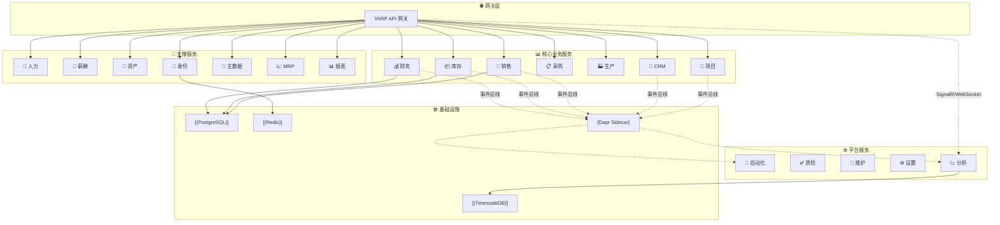
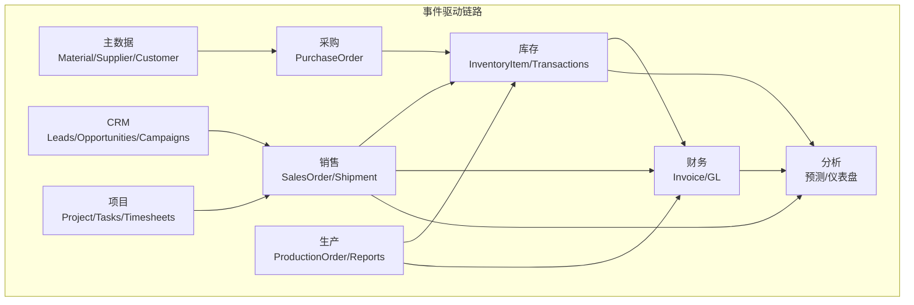
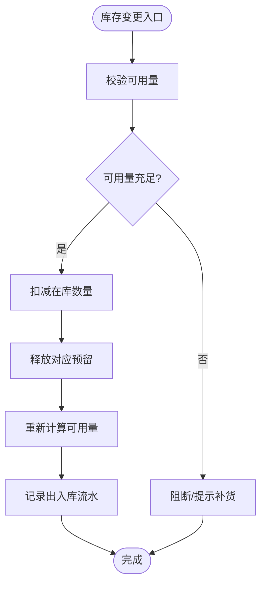
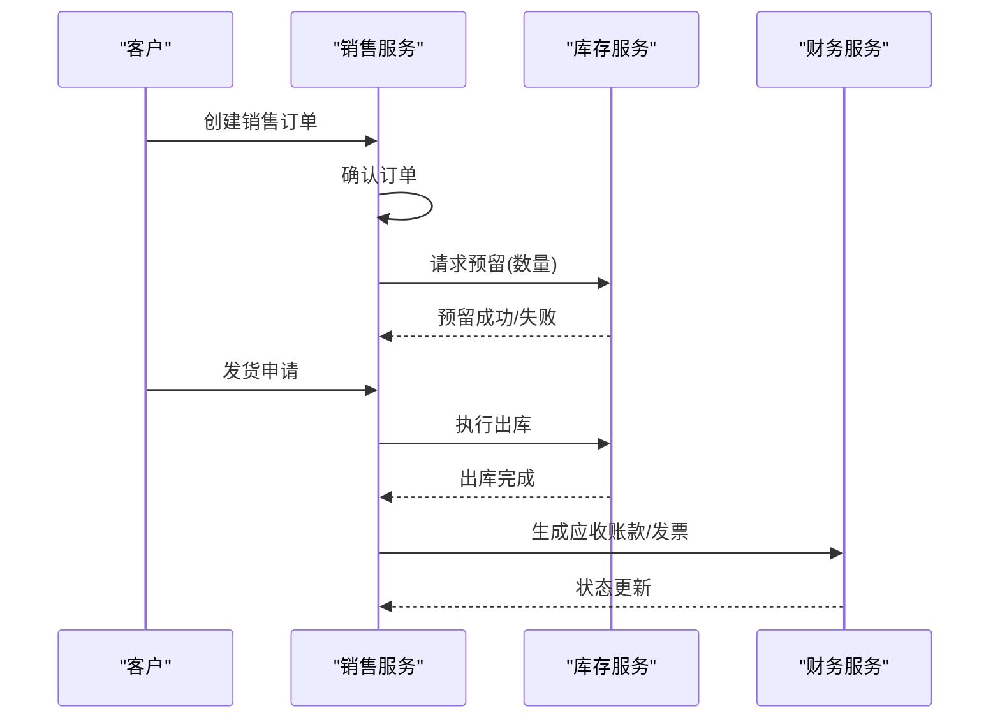
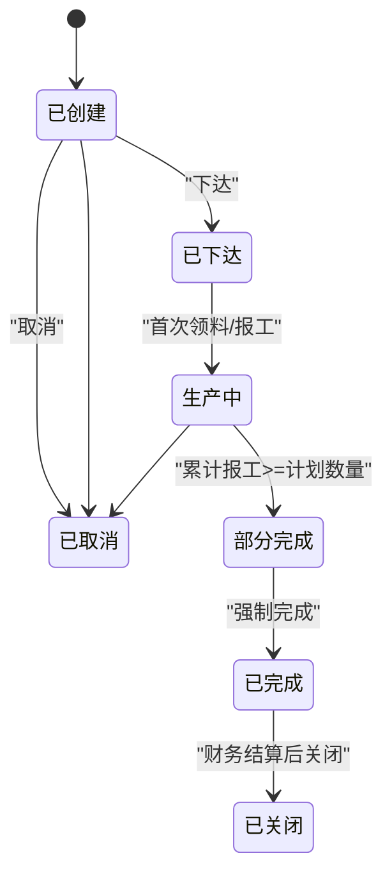
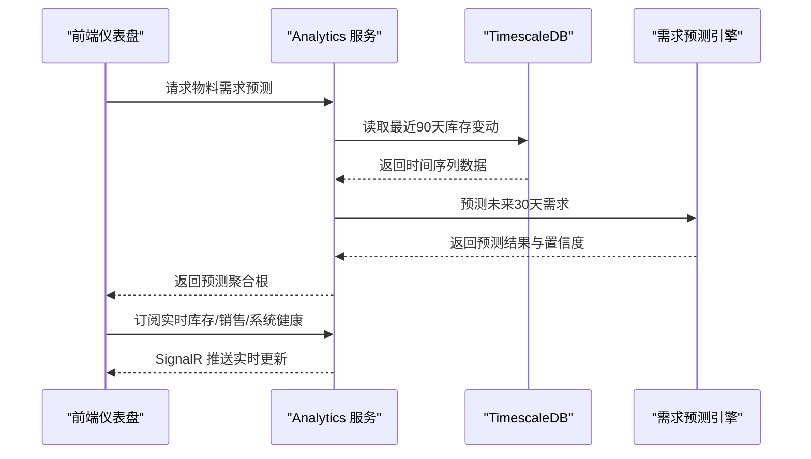
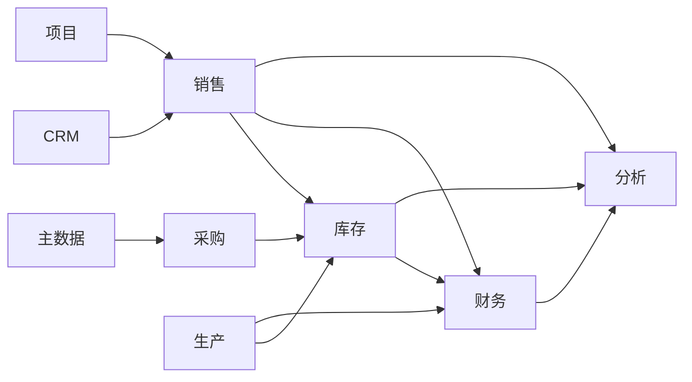

# 核心功能特性

<cite>
**本文引用的文件**
- [README.md](file://README.md)
- [DEVELOPMENT_PLAN.md](file://DEVELOPMENT_PLAN.md)
- [PRD-01-MasterData-Service.md](file://docs/PRD-01-MasterData-Service.md)
- [PRD-05-Inventory-Service.md](file://docs/PRD-05-Inventory-Service.md)
- [PRD-07-Production-Service.md](file://docs/PRD-07-Production-Service.md)
- [PRD-09-Next-Iteration-Intelligence.md](file://docs/PRD-09-Next-Iteration-Intelligence.md)
- [InvoiceAggregate.cs](file://src/Services/Finance/ErpSystem.Finance/Domain/InvoiceAggregate.cs)
- [ForecastingAppService.cs](file://src/Services/Analytics/ErpSystem.Analytics/Application/ForecastingAppService.cs)
- [ProjectAggregate.cs](file://src/Services/Projects/ErpSystem.Projects/Domain/ProjectAggregate.cs)
- [DashboardService.cs](file://src/Services/Reporting/ErpSystem.Reporting/Application/DashboardService.cs)
- [PurchaseOrderAggregate.cs](file://src/Services/Procurement/ErpSystem.Procurement/Domain/PurchaseOrderAggregate.cs)
- [SalesOrderAggregate.cs](file://src/Services/Sales/ErpSystem.Sales/Domain/SalesOrderAggregate.cs)
</cite>

## 目录
1. [引言](#引言)
2. [项目结构](#项目结构)
3. [核心组件](#核心组件)
4. [架构总览](#架构总览)
5. [详细组件分析](#详细组件分析)
6. [依赖分析](#依赖分析)
7. [性能考虑](#性能考虑)
8. [故障排除指南](#故障排除指南)
9. [结论](#结论)
10. [附录](#附录)

## 引言
本文件面向业务用户与技术人员，系统化梳理 ERP 系统核心功能特性，覆盖财务管理、供应链管理、销售管理、生产制造、人力资源、项目管理等主要业务领域，阐述各模块的核心价值与典型业务场景；同时介绍实时分析与 AI 预测能力的创新点，给出功能优先级与成熟度说明，并解释模块间集成关系与数据流转路径，帮助读者快速理解系统能力边界与落地节奏。

## 项目结构
系统采用微服务架构，围绕“领域驱动设计（DDD）+ 事件溯源（Event Sourcing）+ CQRS + Dapr 服务总线”的企业级设计模式，形成“网关层 + 业务核心服务 + 支撑服务 + 平台服务 + 基础设施”的分层布局。前端通过 YARP 网关统一访问各业务服务，平台侧提供 Analytics、Automation、Quality、Maintenance、Settings 等能力，基础设施包含 PostgreSQL/TimescaleDB、Redis、Dapr Sidecar 等。



图表来源
- [README.md](file://README.md#L130-L183)

章节来源
- [README.md](file://README.md#L130-L183)
- [DEVELOPMENT_PLAN.md](file://DEVELOPMENT_PLAN.md#L34-L53)

## 核心组件
- 财务管理（Finance）
  - 双向记账总账、科目表、试算平衡与财务报表
  - 应收应付、发票生命周期、自动凭证生成
  - 资产管理与折旧
  - 价值核算与成本归集（与库存/生产联动）
- 供应链管理（采购/库存/MRP）
  - 多仓库库存、实时库存预留、出入库流水
  - 采购订单生命周期与收货质检
  - MRP 自动补货建议与多级 BOM 展开
- 销售管理（Sales/CRM）
  - 订单到收款 OTC 工作流
  - 客户 360° 视图、商机与线索管理
  - 发货跟踪、开票与销售分析
- 生产制造（Production）
  - 生产物料清单、生产订单状态机、在制品（WIP）管理
  - 投料出库、报工入库、与库存/成本联动
- 人力资源（HR/Payroll）
  - 员工全生命周期、组织架构、薪酬结算与薪资条
  - 身份与 RBAC、数据权限
- 项目管理（Projects/Timesheets）
  - 项目全生命周期、任务与里程碑、资源与预算
  - 工时与资源规划
- 实时分析与 AI 预测（Analytics）
  - 实时仪表盘（SignalR/WebSocket）
  - 需求预测（ML.NET）、时间序列分析（TimescaleDB）

章节来源
- [README.md](file://README.md#L37-L126)
- [PRD-01-MasterData-Service.md](file://docs/PRD-01-MasterData-Service.md#L1-L120)
- [PRD-05-Inventory-Service.md](file://docs/PRD-05-Inventory-Service.md#L8-L35)
- [PRD-07-Production-Service.md](file://docs/PRD-07-Production-Service.md#L8-L28)
- [PRD-09-Next-Iteration-Intelligence.md](file://docs/PRD-09-Next-Iteration-Intelligence.md#L15-L66)

## 架构总览
系统以 Dapr 为服务边车，结合事件总线实现跨服务解耦；Finance/Inventory/Sales 等核心服务通过领域事件驱动上下游协作；Analytics 通过 TimescaleDB 进行时间序列聚合，结合 SignalR 实现实时仪表盘；Identity 提供统一鉴权与数据权限；Reporting 聚合多服务数据形成全局看板。



图表来源
- [README.md](file://README.md#L130-L183)
- [PRD-05-Inventory-Service.md](file://docs/PRD-05-Inventory-Service.md#L446-L478)
- [PRD-07-Production-Service.md](file://docs/PRD-07-Production-Service.md#L374-L401)

## 详细组件分析

### 财务管理（Finance）
- 核心价值
  - 以双分录总账为核心，贯通采购入库、销售出库、生产投料/报工等业务，自动生成会计凭证，确保财务数据一致与可追溯。
  - 与库存/成本模块联动，实现移动加权平均法库存估值与在制品成本归集。
- 典型场景
  - 发票创建、行项目更新、开票、收款、坏账核销与作废。
  - 与库存/销售/生产事件集成，驱动应收应付与成本结转。
- 关键实现要点
  - 发票聚合根定义了状态机与业务规则，确保状态变更与金额计算正确。
  - 通过领域事件向外广播，供财务读模型投影与报表消费。

```mermaid
classDiagram
class 发票 {
+编号
+类型
+对方
+日期
+到期日
+币种
+状态
+总金额
+已付金额
+未清金额
+创建(参数)
+更新行项目(行集合)
+开票()
+收款(金额,日期,方式,参考号)
+核销(原因)
+作废(原因)
}
发票 : "状态机 : 草稿/已开票/部分/全部/核销/作废"
发票 : "行项目 : 数量/单价/税率/含税金额"
```

图表来源
- [InvoiceAggregate.cs](file://src/Services/Finance/ErpSystem.Finance/Domain/InvoiceAggregate.cs#L67-L176)

章节来源
- [InvoiceAggregate.cs](file://src/Services/Finance/ErpSystem.Finance/Domain/InvoiceAggregate.cs#L1-L176)
- [PRD-09-Next-Iteration-Intelligence.md](file://docs/PRD-09-Next-Iteration-Intelligence.md#L32-L44)

### 供应链管理（采购/库存/MRP）
- 核心价值
  - 以“数量准确性”为核心，提供实时库存余额、流水与预留能力，避免超卖与缺货。
  - MRP 自动补货建议与多级 BOM 展开，降低库存积压与断料风险。
- 典型场景
  - 采购收货入库、销售发货出库、生产领料/报工、库存盘点与调整。
  - 安全库存预警、补货建议生成、与财务成本联动。
- 关键实现要点
  - 库存台账（InventoryItem）维护 OnHand/Reserved/Available 三类数量，出入库通过 StockTransaction 记录。
  - 采购订单聚合根驱动收货流程，状态机覆盖草稿、待审、已批准、已发送、部分/全部收货、关闭/取消。
  - MRP 通过“预测可用量 = 在库 - 销售预留 + 在途采购 + 在制生产”触发补货。



图表来源
- [PRD-05-Inventory-Service.md](file://docs/PRD-05-Inventory-Service.md#L198-L226)

章节来源
- [PRD-05-Inventory-Service.md](file://docs/PRD-05-Inventory-Service.md#L8-L35)
- [PRD-05-Inventory-Service.md](file://docs/PRD-05-Inventory-Service.md#L162-L372)
- [PurchaseOrderAggregate.cs](file://src/Services/Procurement/ErpSystem.Procurement/Domain/PurchaseOrderAggregate.cs#L85-L202)
- [PRD-09-Next-Iteration-Intelligence.md](file://docs/PRD-09-Next-Iteration-Intelligence.md#L17-L30)

### 销售管理（Sales/CRM）
- 核心价值
  - 从订单到收款的端到端 OTC 流程，结合 CRM 客户 360° 视图与商机管理，提升销售转化与回款效率。
- 典型场景
  - 销售订单确认、发货处理、发票生成、收款入账。
  - 客户信用控制、销售趋势分析、销售机会跟进。
- 关键实现要点
  - 销售订单聚合根维护状态机与发货进度，与库存预留/出库联动。
  - CRM 聚合线索、商机与活动，支撑销售漏斗分析。



图表来源
- [PRD-05-Inventory-Service.md](file://docs/PRD-05-Inventory-Service.md#L341-L359)
- [SalesOrderAggregate.cs](file://src/Services/Sales/ErpSystem.Sales/Domain/SalesOrderAggregate.cs#L67-L151)

章节来源
- [PRD-05-Inventory-Service.md](file://docs/PRD-05-Inventory-Service.md#L297-L372)
- [SalesOrderAggregate.cs](file://src/Services/Sales/ErpSystem.Sales/Domain/SalesOrderAggregate.cs#L1-L151)

### 生产制造（Production）
- 核心价值
  - 以生产订单为主线，串联投料、报工、入库与成本归集，实现 WIP 实时统计与在制品成本管理。
- 典型场景
  - 生产订单创建/下达/开始/完成/关闭/取消；投料出库与报工入库；在制品视图与进度跟踪。
- 关键实现要点
  - 生产订单状态机覆盖 Created → Released → InProgress → PartiallyCompleted → Completed → Closed/Cancelled。
  - 与库存服务集成，驱动原材料出库与成品入库；与财务集成，支持成本归集。



图表来源
- [PRD-07-Production-Service.md](file://docs/PRD-07-Production-Service.md#L101-L124)

章节来源
- [PRD-07-Production-Service.md](file://docs/PRD-07-Production-Service.md#L8-L28)
- [PRD-07-Production-Service.md](file://docs/PRD-07-Production-Service.md#L172-L310)
- [PRD-07-Production-Service.md](file://docs/PRD-07-Production-Service.md#L374-L401)

### 人力资源与薪酬（HR/Payroll）
- 核心价值
  - 员工全生命周期管理与组织架构维护，结合身份与 RBAC 提供数据权限隔离；薪酬结算与薪资条生成。
- 典型场景
  - 员工入职/转岗/离职、部门与岗位管理、薪酬计算与发放。
- 关键实现要点
  - 与 Identity 服务集成，基于用户上下文与数据域权限控制访问。

章节来源
- [README.md](file://README.md#L90-L96)

### 项目管理（Projects/Timesheets）
- 核心价值
  - 项目全生命周期管理、任务与里程碑、团队成员与预算控制；Timesheets 支撑资源与成本归集。
- 典型场景
  - 项目立项、任务分解、进度跟踪、里程碑达成、预算执行与变更。
- 关键实现要点
  - 项目聚合根维护状态、任务与里程碑、团队成员与预算；支持进度百分比与逾期判断。

```mermaid
classDiagram
class 项目 {
+编号
+名称
+类型
+状态
+开始/结束日期
+计划预算/实际成本
+添加任务(标题,优先级,截止日期,...)
+更新任务进度(任务ID,百分比)
+完成任务(任务ID,实际工时)
+添加里程碑(名称,截止日期)
+达成里程碑(里程碑ID)
+添加成员(用户ID,角色)
+更新预算(新预算,原因)
+变更状态(新状态)
}
class 任务 {
+编号
+标题
+状态/优先级
+预计/实际工时
+进度百分比
+指派给(用户ID)
+更新进度(百分比)
+完成(实际工时)
}
class 里程碑 {
+名称
+截止日期
+是否达成
+达成时间
+标记达成()
}
项目 "包含" 任务
项目 "包含" 里程碑
```

图表来源
- [ProjectAggregate.cs](file://src/Services/Projects/ErpSystem.Projects/Domain/ProjectAggregate.cs#L282-L448)

章节来源
- [ProjectAggregate.cs](file://src/Services/Projects/ErpSystem.Projects/Domain/ProjectAggregate.cs#L1-L451)

### 实时分析与 AI 预测（Analytics）
- 核心价值
  - 基于 TimescaleDB 的高性能时间序列存储与聚合，结合 ML.NET 的需求预测模型，提供“所见即所得”的实时仪表盘与智能安全库存建议。
- 典型场景
  - 销售趋势、库存结构、财务摘要、实时库存移动与预警。
- 关键实现要点
  - ForecastingAppService 负责提取历史数据、运行预测引擎、保存预测聚合根。
  - DashboardService 提供汇总指标、趋势、库存状态、Top 产品与近期活动。



图表来源
- [ForecastingAppService.cs](file://src/Services/Analytics/ErpSystem.Analytics/Application/ForecastingAppService.cs#L10-L42)
- [DashboardService.cs](file://src/Services/Reporting/ErpSystem.Reporting/Application/DashboardService.cs#L14-L87)

章节来源
- [ForecastingAppService.cs](file://src/Services/Analytics/ErpSystem.Analytics/Application/ForecastingAppService.cs#L1-L42)
- [DashboardService.cs](file://src/Services/Reporting/ErpSystem.Reporting/Application/DashboardService.cs#L1-L87)
- [PRD-09-Next-Iteration-Intelligence.md](file://docs/PRD-09-Next-Iteration-Intelligence.md#L60-L66)

## 依赖分析
- 服务耦合与集成
  - 通过 Dapr Pub/Sub 与事件总线实现松耦合；核心链路（采购→库存→财务、销售→库存→财务、生产→库存→财务）以领域事件驱动。
  - 主数据（MasterData）为多服务共享的权威源，提供物料、供应商、客户、仓库等基础数据。
- 数据一致性与可观测性
  - 事件溯源确保审计与可追溯；Outbox/Inbox 保障跨服务消息可靠投递；Observability 提供端到端链路追踪。
- 外部依赖
  - TimescaleDB 用于时间序列聚合；Redis 用于缓存与状态；Dapr Sidecar 提供服务发现、消息与状态管理。



图表来源
- [PRD-01-MasterData-Service.md](file://docs/PRD-01-MasterData-Service.md#L696-L740)
- [PRD-05-Inventory-Service.md](file://docs/PRD-05-Inventory-Service.md#L446-L478)
- [PRD-07-Production-Service.md](file://docs/PRD-07-Production-Service.md#L374-L401)

章节来源
- [PRD-01-MasterData-Service.md](file://docs/PRD-01-MasterData-Service.md#L696-L740)
- [PRD-05-Inventory-Service.md](file://docs/PRD-05-Inventory-Service.md#L446-L478)
- [PRD-07-Production-Service.md](file://docs/PRD-07-Production-Service.md#L374-L401)

## 性能考虑
- 查询与写入性能
  - 库存余额与流水查询、销售趋势与仪表盘聚合在合理数据规模下应满足毫秒级响应。
  - 事件发布与读模型投影采用异步处理，确保写入路径低延迟。
- 可扩展性
  - 通过微服务拆分与 Dapr Sidecar 实现水平扩展；TimescaleDB 优化时间序列查询。
- 可靠性
  - Outbox/Inbox 与幂等处理保障跨服务一致性；Resilience 策略（重试/熔断/超时）提升系统韧性。

## 故障排除指南
- 常见问题
  - 库存超卖：检查预留与可用量计算逻辑，确认出库前已创建预留且未过期。
  - 发票状态异常：核对发票状态机约束与支付入账顺序，避免重复入账或超额入账。
  - 生产订单无法完成：确认报工数量与计划数量关系，检查状态机流转条件。
- 排查建议
  - 查看领域事件与读模型投影日志，定位事件丢失或投影延迟。
  - 使用 Observability 工具追踪请求链路，定位慢调用与错误节点。
  - 检查 Dapr Pub/Sub 订阅与消息去重（Inbox）表，确保幂等性。

章节来源
- [PRD-05-Inventory-Service.md](file://docs/PRD-05-Inventory-Service.md#L481-L498)
- [InvoiceAggregate.cs](file://src/Services/Finance/ErpSystem.Finance/Domain/InvoiceAggregate.cs#L92-L140)
- [PRD-07-Production-Service.md](file://docs/PRD-07-Production-Service.md#L411-L428)

## 结论
本 ERP 系统以事件驱动与领域模型为核心，围绕财务、供应链、销售、生产、人力与项目管理构建了高内聚、低耦合的微服务体系，并通过 Analytics 与 AI 预测实现从“数字化核心”到“智能自动化”的跃迁。建议优先落地主数据、采购→库存→财务闭环与销售→库存→财务闭环，随后推进 MRP、预测分析与自动化规则引擎，持续提升运营效率与决策智能化水平。

## 附录
- 功能优先级与成熟度
  - P0：主数据、采购收货入库、销售发货出库、生产报工入库、财务发票与收款、实时仪表盘。
  - P1：库存调整与盘点、销售信用控制、生产领料、MRP 补货建议、预测模型训练与上线。
  - P2：批次/库位管理、委外加工、质量检验、成本核算深度集成、自动化规则配置界面。
- 技术与模式
  - DDD/事件溯源/CQRS/Outbox/Resilience/多租户/可观测性/容器化与云原生部署。

章节来源
- [PRD-01-MasterData-Service.md](file://docs/PRD-01-MasterData-Service.md#L743-L775)
- [PRD-05-Inventory-Service.md](file://docs/PRD-05-Inventory-Service.md#L500-L521)
- [PRD-07-Production-Service.md](file://docs/PRD-07-Production-Service.md#L431-L452)
- [PRD-09-Next-Iteration-Intelligence.md](file://docs/PRD-09-Next-Iteration-Intelligence.md#L79-L95)