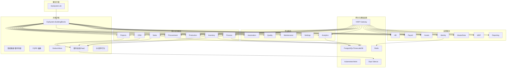
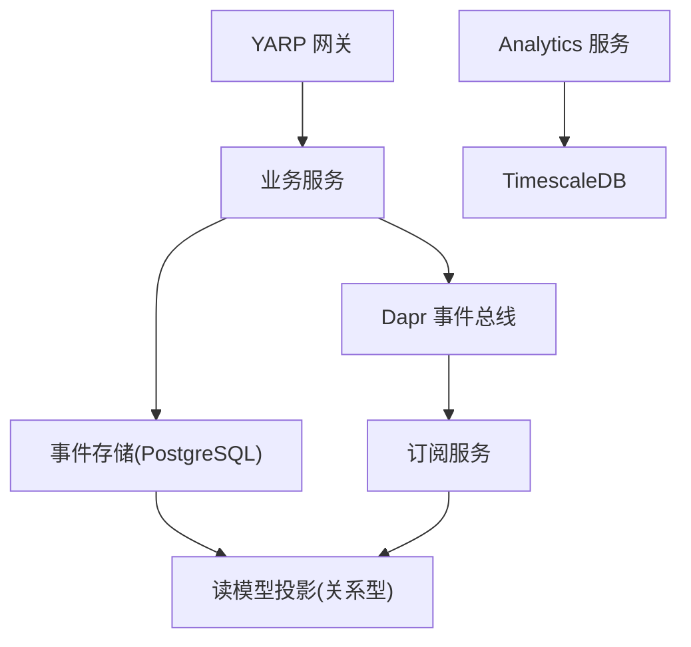
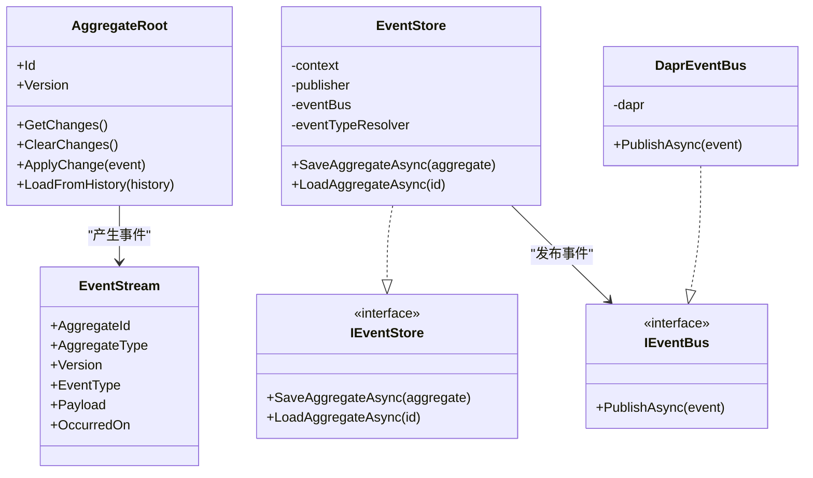
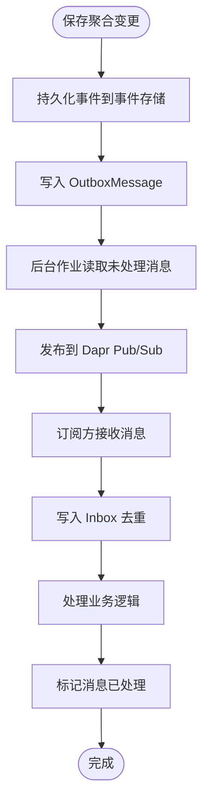
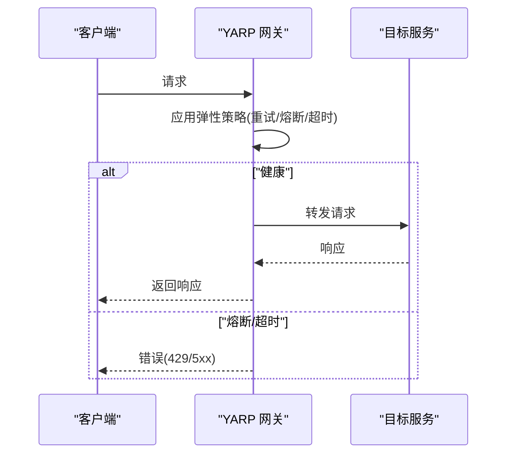
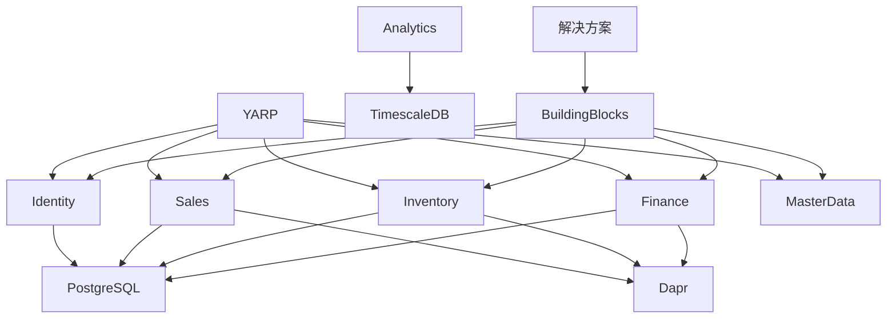

# 项目概述

<cite>
**本文引用的文件**
- [README.md](file://README.md)
- [DEVELOPMENT_PLAN.md](file://DEVELOPMENT_PLAN.md)
- [src/ErpSystem.sln](file://src/ErpSystem.sln)
- [src/BuildingBlocks/ErpSystem.BuildingBlocks/DependencyInjection.cs](file://src/BuildingBlocks/ErpSystem.BuildingBlocks/DependencyInjection.cs)
- [src/BuildingBlocks/ErpSystem.BuildingBlocks/Domain/DDDBase.cs](file://src/BuildingBlocks/ErpSystem.BuildingBlocks/Domain/DDDBase.cs)
- [src/BuildingBlocks/ErpSystem.BuildingBlocks/Outbox/OutboxMessage.cs](file://src/BuildingBlocks/ErpSystem.BuildingBlocks/Outbox/OutboxMessage.cs)
- [src/BuildingBlocks/ErpSystem.BuildingBlocks/EventBus/DaprEventBus.cs](file://src/BuildingBlocks/ErpSystem.BuildingBlocks/EventBus/DaprEventBus.cs)
- [src/Services/Finance/ErpSystem.Finance/Program.cs](file://src/Services/Finance/ErpSystem.Finance/Program.cs)
- [src/Services/Identity/ErpSystem.Identity/Program.cs](file://src/Services/Identity/ErpSystem.Identity/Program.cs)
- [src/Gateways/ErpSystem.Gateway/Program.cs](file://src/Gateways/ErpSystem.Gateway/Program.cs)
- [docs/PRD-01-MasterData-Service.md](file://docs/PRD-01-MasterData-Service.md)
- [deploy/k8s/namespace.yaml](file://deploy/k8s/namespace.yaml)
</cite>

## 目录
1. [引言](#引言)
2. [项目结构](#项目结构)
3. [核心组件](#核心组件)
4. [架构总览](#架构总览)
5. [详细组件分析](#详细组件分析)
6. [依赖分析](#依赖分析)
7. [性能考虑](#性能考虑)
8. [故障排查指南](#故障排查指南)
9. [结论](#结论)
10. [附录](#附录)

## 引言
本项目是一个基于 .NET 10 的企业级 ERP 微服务系统，采用云原生、事件驱动与领域驱动设计（DDD）相结合的架构，覆盖财务、供应链、销售、生产、人力资源、项目管理、质量管理、资产管理、实时分析与预测等多个业务域。项目强调可扩展性、可观测性、可靠性与企业级合规能力，通过事件溯源（Event Sourcing）、CQRS、Outbox/Inbox、Dapr 服务网格与 Kubernetes 编排，构建高内聚低耦合的业务服务生态。

本概述旨在帮助初学者快速理解系统愿景与整体思路，同时为有经验的开发者提供深入的技术细节与最佳实践参考。

## 项目结构
项目采用“解决方案 + 多微服务 + 共享内核”的组织方式：
- 解决方案文件集中管理所有服务与测试项目
- BuildingBlocks 提供跨服务的通用基础设施（领域基类、CQRS 抽象、事件总线、Outbox、中间件、多租户等）
- Services 目录按业务域拆分微服务，每个服务包含 API、应用层、领域层、基础设施层
- Gateways 提供统一入口网关（YARP），内置弹性与限流策略
- Deploy 提供 Kubernetes 与 Helm 部署清单
- Docs 提供产品需求文档与部署指南

图表来源
- [src/ErpSystem.sln](file://src/ErpSystem.sln#L1-L400)
- [README.md](file://README.md#L130-L183)

章节来源
- [README.md](file://README.md#L289-L322)
- [src/ErpSystem.sln](file://src/ErpSystem.sln#L1-L400)

## 核心组件
- 共享内核（BuildingBlocks）
  - 领域基类：聚合根、领域事件、事件流、事件存储接口与实现
  - CQRS 抽象：命令/查询与处理器接口
  - Outbox/Inbox：事务性可靠消息投递
  - 事件总线：基于 Dapr 的 Pub/Sub
  - 中间件与行为：验证、日志、幂等、审计、性能监控
  - 多租户：查询过滤与拦截器
  - 缓存与可观测性：分布式缓存扩展与指标采集
- 网关（YARP）
  - 反向代理、健康检查、速率限制、弹性策略（重试/熔断/超时）
- 事件溯源与 CQRS
  - 写模型：聚合根产生领域事件，事件持久化到事件存储
  - 读模型：订阅事件，投影到关系型读库，供查询高效访问
- 服务边界
  - 财务、库存、销售、采购、生产、CRM、项目、HR、薪酬、资产、主数据、MRP、报告、质量、自动化、维护、设置、分析等

章节来源
- [README.md](file://README.md#L185-L213)
- [src/BuildingBlocks/ErpSystem.BuildingBlocks/DependencyInjection.cs](file://src/BuildingBlocks/ErpSystem.BuildingBlocks/DependencyInjection.cs#L10-L30)
- [src/BuildingBlocks/ErpSystem.BuildingBlocks/Domain/DDDBase.cs](file://src/BuildingBlocks/ErpSystem.BuildingBlocks/Domain/DDDBase.cs#L15-L58)
- [src/BuildingBlocks/ErpSystem.BuildingBlocks/Outbox/OutboxMessage.cs](file://src/BuildingBlocks/ErpSystem.BuildingBlocks/Outbox/OutboxMessage.cs#L10-L55)
- [src/BuildingBlocks/ErpSystem.BuildingBlocks/EventBus/DaprEventBus.cs](file://src/BuildingBlocks/ErpSystem.BuildingBlocks/EventBus/DaprEventBus.cs#L6-L27)

## 架构总览
系统采用“网关 + 微服务 + 事件总线 + 读写分离”的企业级架构：
- 网关层：YARP 提供统一入口，内置弹性与限流
- 业务服务：按领域拆分，独立数据库与读模型
- 事件总线：Dapr Pub/Sub 实现松耦合通信
- 数据层：事件存储（PostgreSQL JSONB）+ 读库（关系型）+ TimescaleDB（时序分析）

图表来源
- [README.md](file://README.md#L130-L183)
- [src/Gateways/ErpSystem.Gateway/Program.cs](file://src/Gateways/ErpSystem.Gateway/Program.cs#L26-L62)

章节来源
- [README.md](file://README.md#L130-L183)

## 详细组件分析

### 事件存储与领域建模
- 聚合根与领域事件：通过聚合根收集领域变更，形成事件流；事件存储负责持久化事件并触发发布
- 事件加载：根据事件流重建聚合状态，支持版本追踪与审计
- 事件总线：事件发布到 Dapr Pub/Sub，订阅方进行投影与处理

图表来源
- [src/BuildingBlocks/ErpSystem.BuildingBlocks/Domain/DDDBase.cs](file://src/BuildingBlocks/ErpSystem.BuildingBlocks/Domain/DDDBase.cs#L15-L58)
- [src/BuildingBlocks/ErpSystem.BuildingBlocks/Domain/DDDBase.cs](file://src/BuildingBlocks/ErpSystem.BuildingBlocks/Domain/DDDBase.cs#L60-L132)
- [src/BuildingBlocks/ErpSystem.BuildingBlocks/EventBus/DaprEventBus.cs](file://src/BuildingBlocks/ErpSystem.BuildingBlocks/EventBus/DaprEventBus.cs#L6-L27)

章节来源
- [src/BuildingBlocks/ErpSystem.BuildingBlocks/Domain/DDDBase.cs](file://src/BuildingBlocks/ErpSystem.BuildingBlocks/Domain/DDDBase.cs#L15-L153)
- [src/BuildingBlocks/ErpSystem.BuildingBlocks/EventBus/DaprEventBus.cs](file://src/BuildingBlocks/ErpSystem.BuildingBlocks/EventBus/DaprEventBus.cs#L11-L27)

### Outbox/Inbox 可靠消息
- Outbox：在保存领域事件的同一事务中写入 OutboxMessage，后台作业异步发布，保证“先落库再发布”
- Inbox：消费者收到消息后先写入 Inbox 去重，处理成功后标记完成，实现幂等

图表来源
- [src/BuildingBlocks/ErpSystem.BuildingBlocks/Outbox/OutboxMessage.cs](file://src/BuildingBlocks/ErpSystem.BuildingBlocks/Outbox/OutboxMessage.cs#L10-L55)

章节来源
- [src/BuildingBlocks/ErpSystem.BuildingBlocks/Outbox/OutboxMessage.cs](file://src/BuildingBlocks/ErpSystem.BuildingBlocks/Outbox/OutboxMessage.cs#L10-L82)

### 网关弹性与限流
- 重试：指数退避 + 抖动，避免雪崩
- 熔断：下游失败率阈值触发，保护后端
- 超时：快速失败，释放资源
- 速率限制：防止过载

图表来源
- [src/Gateways/ErpSystem.Gateway/Program.cs](file://src/Gateways/ErpSystem.Gateway/Program.cs#L34-L62)

章节来源
- [src/Gateways/ErpSystem.Gateway/Program.cs](file://src/Gateways/ErpSystem.Gateway/Program.cs#L1-L111)

### 服务启动与依赖注入（示例：Finance 与 Identity）
- Finance：注册事件存储、MediatR、控制器、Swagger、DB 上下文、Dapr 事件总线
- Identity：注册事件存储、MediatR、控制器、Swagger、DB 上下文、Dapr 事件总线、健康检查

章节来源
- [src/Services/Finance/ErpSystem.Finance/Program.cs](file://src/Services/Finance/ErpSystem.Finance/Program.cs#L12-L77)
- [src/Services/Identity/ErpSystem.Identity/Program.cs](file://src/Services/Identity/ErpSystem.Identity/Program.cs#L13-L75)

### 业务场景与用例（主数据服务）
- 场景：物料主数据从创建、审批、启用到发布领域事件，其他服务订阅并同步
- 流程：物料工程师创建 → 填写基础信息/扩展属性 → 提交审批 → 财务设置标准成本 → 审批通过 → 启用 → 发布事件 → 其他服务订阅同步
- API：物料 CRUD、成本更新、启用/停用、替代品查询、成本历史查询等

章节来源
- [docs/PRD-01-MasterData-Service.md](file://docs/PRD-01-MasterData-Service.md#L402-L415)
- [docs/PRD-01-MasterData-Service.md](file://docs/PRD-01-MasterData-Service.md#L530-L666)

## 依赖分析
- 语言与运行时：.NET 10
- 通信：Dapr Sidecar（服务调用、Pub/Sub）
- 数据：PostgreSQL（事件存储/读库）、TimescaleDB（时序分析）
- 部署：Kubernetes + Helm
- 网关：YARP
- 事件总线：Dapr Pub/Sub（抽象层，可替换）

图表来源
- [src/ErpSystem.sln](file://src/ErpSystem.sln#L1-L400)
- [README.md](file://README.md#L130-L183)

章节来源
- [src/ErpSystem.sln](file://src/ErpSystem.sln#L1-L400)
- [README.md](file://README.md#L219-L283)

## 性能考虑
- 事件溯源与 CQRS：写模型与读模型分离，读库可独立扩展与索引优化
- Outbox/Inbox：降低消息丢失风险，提升最终一致性
- Dapr 与弹性：重试、熔断、超时与限流，避免级联故障
- TimescaleDB：针对时序数据的高效存储与分析
- 多租户隔离：查询过滤与拦截器，避免跨租户数据泄露

## 故障排查指南
- 事件未发布/未消费
  - 检查事件存储是否持久化、Outbox 是否存在未处理消息
  - 查看事件总线订阅是否正确、主题命名是否匹配
- 服务启动失败
  - 检查连接字符串、数据库初始化、Swagger/健康检查端点
- 网关异常
  - 查看弹性策略配置、熔断状态、限流阈值
- Kubernetes 部署
  - 检查命名空间、服务发现、Ingress 配置与密钥

章节来源
- [src/BuildingBlocks/ErpSystem.BuildingBlocks/Outbox/OutboxMessage.cs](file://src/BuildingBlocks/ErpSystem.BuildingBlocks/Outbox/OutboxMessage.cs#L57-L82)
- [src/BuildingBlocks/ErpSystem.BuildingBlocks/EventBus/DaprEventBus.cs](file://src/BuildingBlocks/ErpSystem.BuildingBlocks/EventBus/DaprEventBus.cs#L29-L43)
- [src/Services/Finance/ErpSystem.Finance/Program.cs](file://src/Services/Finance/ErpSystem.Finance/Program.cs#L64-L74)
- [src/Services/Identity/ErpSystem.Identity/Program.cs](file://src/Services/Identity/ErpSystem.Identity/Program.cs#L62-L71)
- [src/Gateways/ErpSystem.Gateway/Program.cs](file://src/Gateways/ErpSystem.Gateway/Program.cs#L64-L84)
- [deploy/k8s/namespace.yaml](file://deploy/k8s/namespace.yaml#L1-L8)

## 结论
本项目以 DDD 为指导、事件溯源为核心、CQRS 为手段，结合 Dapr 与 Kubernetes，构建了具备高扩展性、可观测性与企业级合规能力的 ERP 微服务系统。通过共享内核沉淀通用能力，各业务服务聚焦领域模型演进，形成稳定、可演进的企业级数据与业务中台。

## 附录
- 快速开始与本地运行、Docker 与 Helm 部署、测试执行等详见项目说明与部署文档
- 开发路线图：已完成 13 个阶段，涵盖基础设施、事件溯源、核心模块、BI 与实时分析、Kubernetes 部署等

章节来源
- [README.md](file://README.md#L217-L341)
- [README.md](file://README.md#L343-L360)